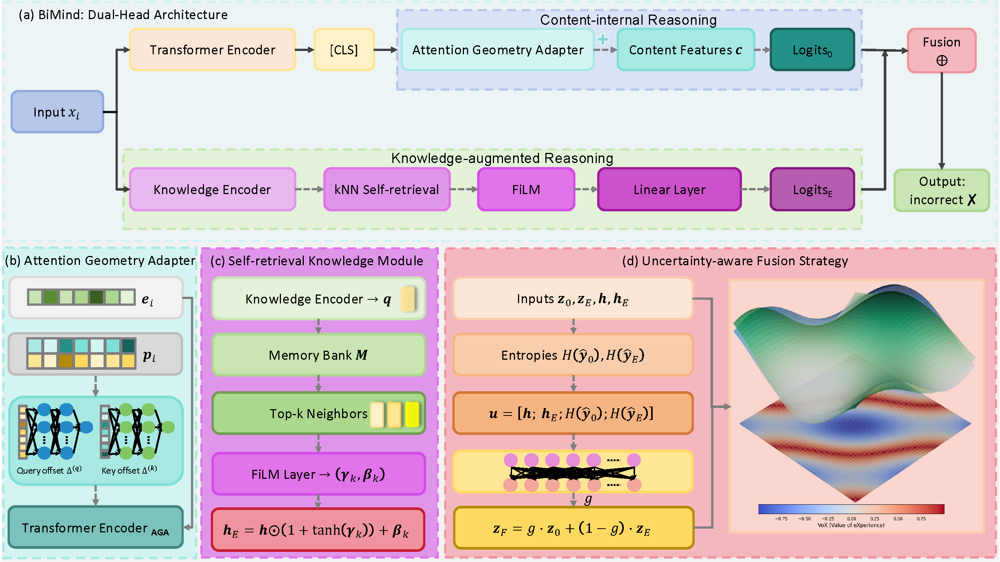

# BiMind: A Dual-Head Reasoning Model with Attention-Geometry Adapter for Incorrect Information Detection

## Abstract

Incorrect information poses significant challenges by disrupting content veracity and integrity, yet most detection approaches struggle to jointly balance textual content verification with external knowledge modification under collapsed attention geometries. To address this issue, we propose a dual-head reasoning framework, **BiMind**, which disentangles *content-internal reasoning* from *knowledge-augmented reasoning*. In BiMind, we introduce three core innovations: (i) an **attention geometry adapter** that reshapes attention logits via token-conditioned offsets and mitigates attention collapse; (ii) a **self-retrieval knowledge mechanism**, which constructs an in-domain semantic memory through kNN retrieval and injects retrieved neighbors via feature-wise linear modulation; (iii) the **uncertainty-aware fusion strategies**, including entropy-gated fusion and a trainable agreement head, stabilized by a symmetric Kullback–Leibler agreement regularizer. To quantify the knowledge contributions, we define a novel metric, **Value-of-eXperience (VoX)**, to measure instance-wise logit gains from knowledge-augmented reasoning. Experiment results on public datasets demonstrate that our BiMind model outperforms advanced detection approaches and provides interpretable diagnostics on when and why knowledge matters.

---

A dual-head incorrect information detection framework that combines a **frozen LLM backbone** (LLaMA-7B) with a **AGA** and **FiLM-based knowledge injection**, inspired by the idea of two reasoning systems — one relying on content itself, another on external knowledge.

---

## Architecture Overview



> *Figure: An illustration of our proposed BiMind framework. (a) Dual-head architecture with a content-internal head (top) and a knowledge-augmented head (bottom). (b) Attention geometry adapter reshapes pre-softmax attention logits via token-conditioned offsets. (c) Self-retrieval knowledge module retrieves top-$k$ neighbors and injects knowledge via FiLM to provide knowledge-augmented representations. (d) Uncertainty-aware fusion combines head logits via an entropy gating, with the VoX metric quantifying the knowledge contributions by comparing head outcomes, where blue and green surfaces in the instance space represent the content and knowledge reasoning heads, respectively.*

**Dual-Head design:**
- **No-experience head (`z0`)** — classifies from text content alone.
- **Experience head (`zE`)** — enhances the text representation via FiLM modulation conditioned on retrieved knowledge.
- **Fusion** — combines both heads via a learned entropy-aware gate (or `logit_avg` / `poe` / `agree_head`).

---

## File Structure

| File | Description |
|---|---|
| `utils.py` | Global singletons (`nlp`, `sentence_model`), seed, tokenisation, POS helpers, knowledge retrieval, diagnostic helpers |
| `dataset.py` | `NewsDataset` (custom transformer), `LLMNewsDataset` (LLM backbone) |
| `models.py` | `LearnedAbsolutePE`, `POSGatedAttentionLayer`, `POSGatedTransformerEncoder`, `L3BTwoBrain`, `LLMWithPOSAdapter`, `L3BTwoBrainLLM` |
| `features.py` | `prepare_features`, `prepare_llm_features` |
| `train.py` | `train_model` (custom transformer), `train_llm_model` (LLM backbone) |
| `evaluate.py` | `test_model` with sym-KL agreement and VoX gain metrics |
| `main.py` | End-to-end entry point |

---

## Requirements

```bash
pip install torch transformers sentence-transformers spacy scikit-learn pandas tqdm
python -m spacy download en_core_web_md
```

A CUDA-capable GPU is strongly recommended. The LLM backbone is loaded in `float16` and frozen by default.

---

## Supported Backbones

Set `LLM_NAME` in `main.py`:

| Model | HuggingFace ID |
|---|---|
| LLaMA-2 7B | `meta-llama/Llama-2-7b-hf` |
| Mistral 7B | `mistralai/Mistral-7B-v0.1` |
| RoBERTa | `roberta-base` |
| DeBERTa | `microsoft/deberta-v3-base` |

---

## Usage

```bash
# Place your dataset CSV (with 'statement' and 'label' columns) in the project root
# Default dataset: ReCOVery.csv

python main.py
```

Training produces `best_llm_model.pth` and prints per-epoch metrics. After training, the best checkpoint is evaluated and classification reports for all three heads are printed.

---

## Fusion Strategies

| Strategy | Description |
|---|---|
| `gate` | Entropy-aware learned gate: $g \cdot z_0 + (1-g) \cdot z_E$ |
| `logit_avg` | Weighted average of logits: $\beta z_0 + (1-\beta) z_E$ |
| `poe` | Product of Experts: $\log(p_0 \cdot p_E)$ |
| `agree_head` | Separate MLP over $[h, h_E, h \odot h_E, |h - h_E|]$ |

---

## Key Design Choices

- **POS-aware adapter**: spaCy POS tags are aligned to LLM subword tokens and injected as additive biases into the hidden states — no LLM weights are modified.
- **FiLM knowledge injection**: retrieved knowledge embeddings modulate the text representation via feature-wise linear modulation (γ, β).
- **Knowledge dropout**: randomly zeroes knowledge vectors during training to prevent over-reliance on the KB.
- **Sym-KL agreement regularisation**: penalises divergence between the two heads to encourage complementary specialisation.
- **Entropy regularisation** (custom transformer only): maximises attention entropy per layer to prevent attention collapse.

---

## Metrics Reported

- Accuracy and weighted F1 for each head (`No-Exp`, `Exp`, `Fused`)
- Symmetric KL divergence between heads (agreement)
- VoX gain: correct-class logit improvement from the Exp head over the No-Exp head

---

## Dataset

Default: [ReCOVery](https://github.com/apurvamulay/ReCOVery) — a COVID-19 dataset.  
Any CSV with `statement` (text) and `label` (class) columns is compatible.

### Data Splits Table

**Dataset — ReCOVery.csv**

| Split                     | Size (samples) | Proportion | Role                 | Used for                                                                 |
|--------------------------|----------------|------------|----------------------|--------------------------------------------------------------------------|
| Total (after dropna)     | ~2,029         | 100%       | Full corpus          | —                                                                        |
| Train                    | 1,643          | ~81%       | Model training       | KB embeddings, TF-IDF/verb vectorizer fitting, label encoder fitting     |
| Validation               | 183            | ~9%        | Hyperparameter tuning| Early stopping, ReduceLROnPlateau                                        |
| Test                     | 203            | ~10%       | Final evaluation     | Accuracy, F1, leakage experiment                                         |

**Splitting procedure** *(two-stage, random_state=0, no stratification)*:

```python
train_test_split(data, test_size=0.1)        # → Train-full (90%) + Test (10%)
train_test_split(train_full, test_size=0.1) # → Train (81%) + Val (9%)
```

---

## Citation

If you use this work, please cite:

```bibtex
@article{zhang2026bimind,
  title={BiMind: A Dual-Head Reasoning Model with Attention-Geometry Adapter for Incorrect Information Detection},
  author={Zhang, Zhongxing and Vraga, Emily K and Huh, Jisu and Srivastava, Jaideep},
  journal={arXiv preprint arXiv:2604.06022},
  year={2026}
}
```
